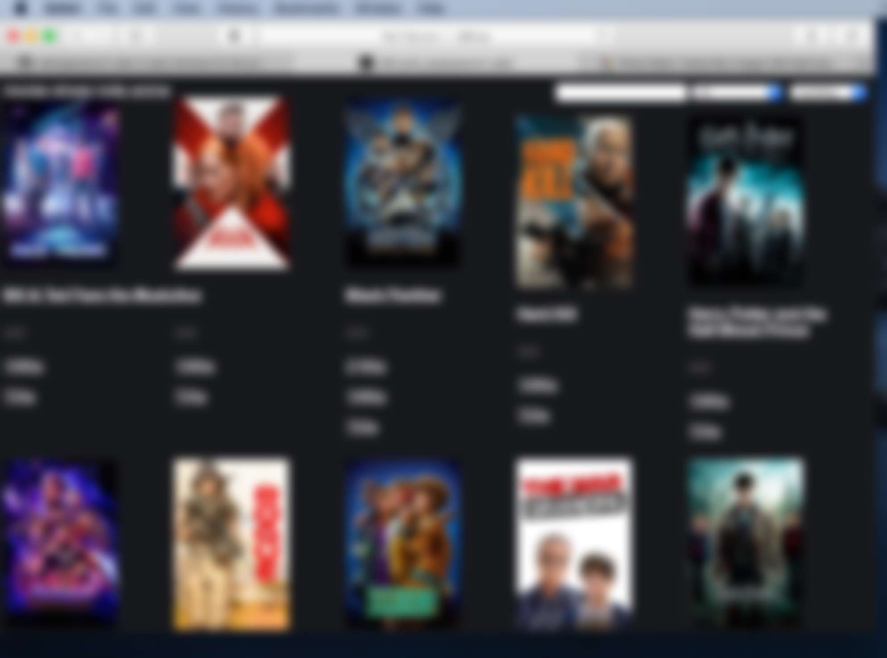

# popcorn-web
A web-interface for the popcorn time api. Allows for popcorntime like streaming from any device with a modern web broswer like an Ipad or Iphone.
popcorn-web connects to the popcorntime API to list media, uses rtorrent to download torrents and ffmpeg to stream h264 video.

## Screenshot (blured)


## Install
* If you already have rtorrent this might overwrite your old rtorrent config file.
* If you want to use nginx just remove the apache specific parts
* You can move the download folders, just make sure you update config.json accordingly

```bash
echo install depencies
sudo apt-get install apache2 php libapache2-mod-php php-curl git rtorrent tmux ffmpeg

echo download popcorn-web to public web folder
sudo chmod 777 /var/www/html
cd /var/www/html

git clone https://github.com/callesg/popcorn-web
cd popcorn-web

echo Create api caching folder
mkdir db
chmod 777 db

echo make the converted video folder avalible on the web
mkdir /tmp/videos
ln -s /tmp/videos videos

echo create download folders
sudo mkdir /media/downloaded_folder /media/downloading_folder /media/torrent_folder
sudo chmod 777 /media/downloaded_folder /media/downloading_folder /media/torrent_folder

echo make the downloaded_folder avalible on the web
ln -s /media/downloaded_folder downloaded_folder

echo setup config.json
cp -a config-example.json config.json

echo setup rtorrent config
mkdir /tmp/rtorrentsession
cp -a .rtorrent.rc ~/.rtorrent.rc
sudo cp -a torrent_done.sh /opt/torrent_done.sh
sudo chmod 555 /opt/torrent_done.sh

echo run rtorrent in tmux 
tmux new-session rtorrent

```

